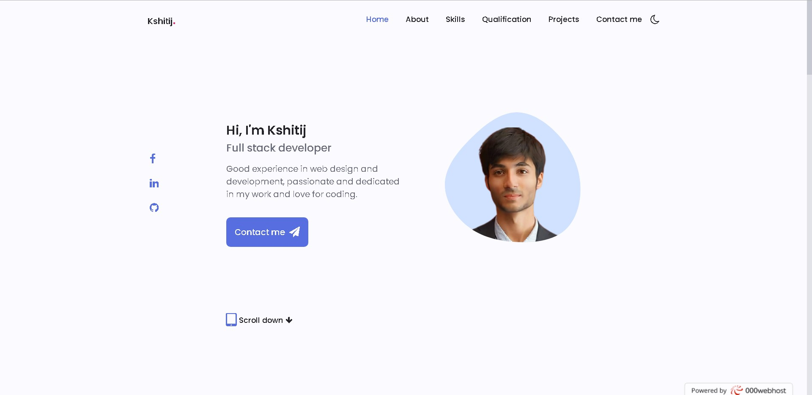
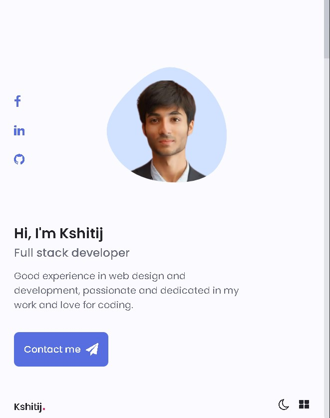

# Personal-Portfolio

<h3>  A full fledged responsive personal portfolio built purely using HTML, CSS and JS with light/dark theme option. </h3>  

<h4> The portfolio gives a detailed view into my skills, qualifications, projects I've worked on along with information on how to reach me.   
  
Original UI credits - <a href="https://github.com/bedimcode/responsive-portfolio-website-Alexa"> here. </a>

Portfolio URL - <a href="https://kshitij-portfolio.000webhostapp.com/"> here. </a> 
